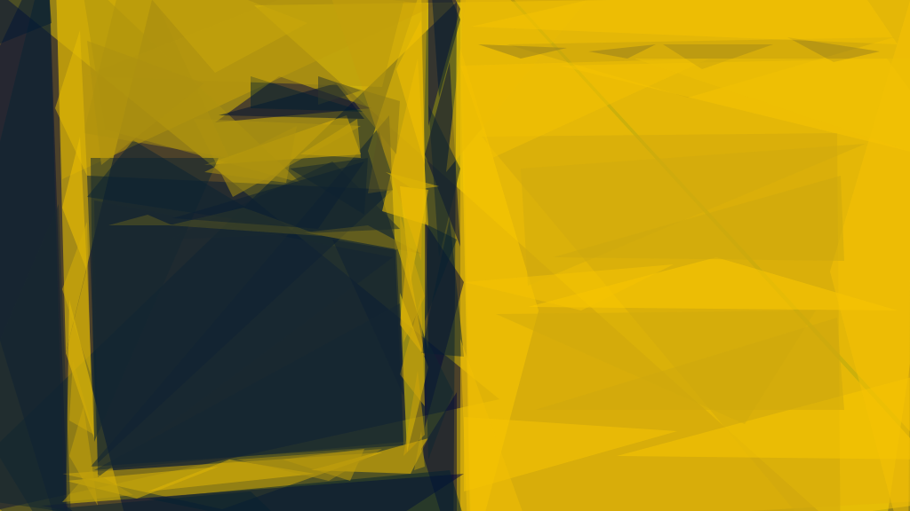

<section class="c-home-section">
<h2 class="c-home-section__heading">My Work</h2>

I have been working as a freelance writer for the past seven years. I write about the arts, most often music and literature, as well as technology, politics, and rural affairs. My writing has appeared in many publications around the world, including <em>The Irish Times</em>, <em>The Sunday Times</em>, <em>The Wire</em>, <em>Winter Papers</em>, <em>Resident Advisor</em>, <em>The Quietus</em>, <em>Gorse</em>, and <em>The Millions</em>.
 

I work as the online editor of Ireland’s leading literature journal, <em><a href="https://stingingfly.org" target="_blank" rel="nofollow">The Stinging Fly</a></em>, where I commission essays and reviews of contemporary literature, and produce a monthly podcast.
 

I’m the founder and editor of <em><a href="https://fallowmedia.com" target="_blank" rel="nofollow">Fallow Media</a></em>, an experimental, reader-funded online arts publication which combines modern web technologies with longform writing and multimedia projects.
 

I also work as a web developer with select artistic organisations and cultural institutions, such as <em>The Stinging Fly</em>, <em>Paper Visual Art</em>, <em>Tramp Press</em>, and the <em>Royal Society of Antiquaries of Ireland</em>.
 

I’m one of the team at <em><a href="http://grayscale.ie/" target="_blank" rel="nofollow">Grayscale</a></em>, where I help to curate innovative audio/visual events in unusual, interesting spaces around Dublin.

If you’d like to talk about working with me on a project, <a href="mailto:imaleney@gmail.com" target="_blank" rel="nofollow">just get in touch</a>.

</section>

<section class="c-home-section">
	<h2 class="c-home-section__heading">Projects</h2>
	
Case studies of interesting work I've been doing recently.

	

		

			

				
			

			

				<h3 class="c-home__project__title">The Stinging Fly</h3>
				
A brand-new website for Ireland’s leading literary journal, including the full digitisation of their twenty-year archive.

			

		

		

			

				
			

			

				<h3 class="c-home__project__title">Fallow Media</h3>
				
One-of-a-kind online projects, collected under the banner of an experimental digital publication.

			

		

		

			

				
			

			

				<h3 class="c-home__project__title">Response To A Request</h3>
				
An adventure in art criticism: twenty-six images, twenty-six essays, two weeks each in existence.

			

		

	

	
More Projects

</section>
<section class="c-home-section">
	<h2 class="c-home-section__heading">Publications</h2>
	
Some recent writing which can be found on the internet.

	

	

	
More Writing

</section>
<section class="c-home-section c-home-section--newsletter">
	<h2 class="c-home-section__heading">Newsletter</h2>
	
Some recent writing which can be found on the internet.

</section>
<section class="c-home-section">
	<h2 class="c-home-section__heading">Notes</h2>
	
Scatterbrained thoughts with nowehre else to go.

	

	

	
More Notes

</section>
<section class="c-home-section c-home-section--contact">
	<h2 class="c-home-section__heading">Get In Touch</h2>
	

		
		
		
	

</section>